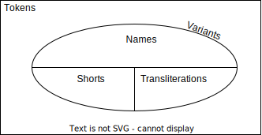

# Alenka 👧

Alenka is a free library for predicting Russian names (and genders) from transliterated and short forms with statistical learning and Levenshtein distance.

Alenka now is not a tool for inflection (see [Lvovich](inflect)) or parsing first/middle/last Russian names from strings. But it will somewhen be.

## Advantages

Useful for social data and media analysis.

🌀 Natively in TypeScript

🔢 Statistically trained

❤ Simple and friendly API

⚙ Configurable

## Usage

Install Alenka with `npm` or `yarn`.

```bash
npm i alenka
yarn add alenka
```

Using with default configuration

```typescript
import { NamePredictor } from "alenka";

const np = new NamePredictor();

np.predictName('Саня', 'male') // 'Александр'
np.predictName('Саня', 'female') // 'Александра'
np.predictName('Саня') // 'Александр' as more frequent
np.predictName('Сирожа') // 'Сергей'
np.predictName('$one4ka') // 'София'
np.predictGender('$one4ka') // female
np.predictName('asdasda') // undefined
```

Using with custom configuration

```typescript
import { NamePredictor } from "alenka";

const options = {
    useLevenshtein: false,
    // minAcceptibleDistance: 1,
    // frequenciesSource: 'vk',
    // handlingCase: 'ignore',
    // handlingYo: 'ignore',
} as const;

const np = new NamePredictor(options);

np.predictName('Сирожа') // 'unedfined'
```

## Terminology



1. Names are full forms of Russian Names (e.g. `Александр` or `София`);
2. Shorts are shotened forms of names (e.g. `Саша` or `Сонечка`);
3. Transliterations are latin versions of names or shorts (e.g. `Alex` or `Sofia`);
4. Variants are names, shorts and transliterations together;
5. Tokens are any strings including variatns (e.g. `$0nechk@`, `abcdefg`).

prediction is mapping a token to a name. It happens via mathcing token agains a dataset of shorts and transliterations with Levenshtein distance to find the closest one and return the relevant name. If nothing matched, undefined will be returned.

## Contribution

Feel free to fork and leave pull requests.

To start development just run following familiar commands. 

```bash
git clone https://github.com/solovevserg/alenka.git
cd alenka
yarn install
yarn test:watch
```

### Roadmap

Here a list of actual tasks to participate at. Thanks in advance for any help.

* Fix problems with handling 'ё'
* Split in the dataset variants for shorts and tranliterations
* Finish README
* Add issues board (bug tracker)
* Add ESLint
* Add missing short forms to the data source
* Write transliteration logic (instead of cyrillic-to-translit-js)
* Optimize performance

## About author

I am sergei Solovev, fullstack TS developer, data analyst and teacher. Look at my works [here](https://sergsol.com/). For fast response find me on [telegram](https://t.me/sergsol)

## Licesnse

Copyright (c) 2022, Sergei Solovev sergey.soloviev@inbox.ru

Permission to use, copy, modify, and/or distribute this software for any
purpose with or without fee is hereby granted, provided that the above
copyright notice and this permission notice appear in all copies.

THE SOFTWARE IS PROVIDED "AS IS" AND THE AUTHOR DISCLAIMS ALL WARRANTIES
WITH REGARD TO THIS SOFTWARE INCLUDING ALL IMPLIED WARRANTIES OF
MERCHANTABILITY AND FITNESS. IN NO EVENT SHALL THE AUTHOR BE LIABLE FOR
ANY SPECIAL, DIRECT, INDIRECT, OR CONSEQUENTIAL DAMAGES OR ANY DAMAGES
WHATSOEVER RESULTING FROM LOSS OF USE, DATA OR PROFITS, WHETHER IN AN
ACTION OF CONTRACT, NEGLIGENCE OR OTHER TORTIOUS ACTION, ARISING OUT OF
OR IN CONNECTION WITH THE USE OR PERFORMANCE OF THIS SOFTWARE.
